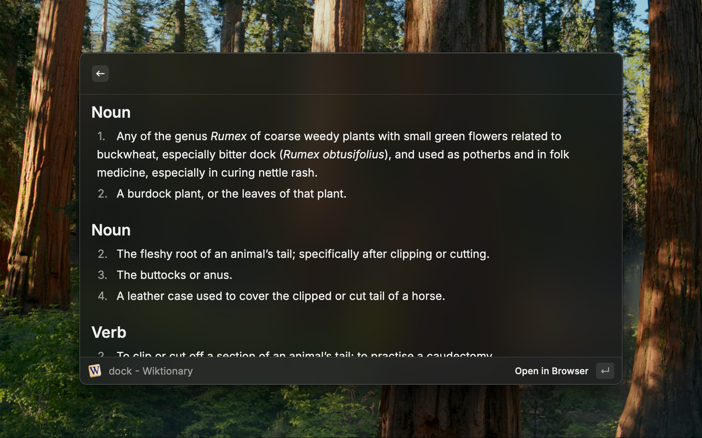

A Raycast extension that fetches and displays word definitions from Wiktionary.


## Installation

After cloning the repository, run the following commands:

```bash
npm install
```

```bash
# Development
npm run dev

# Production
npm run build 
# Then, import the extension in Raycast and choose this directory
```


